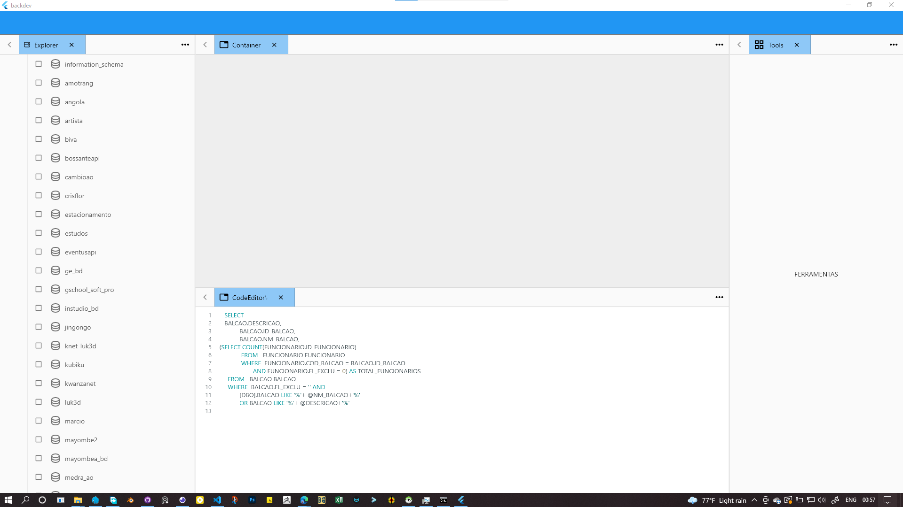

# Backdev

## TODO

### SQL SERVER
* Connect to server. ✅
* Get database list.✅
* get database tables.✅
* Get table columns.✅
* Get stored procedures.✅
* get logs history.✅

### MYSQL
* Connect to mysql. ✅
* Get database list.✅
* get database tables.✅
* Get table columns.✅
* Get stored procedures.✅
* get logs history.✅
